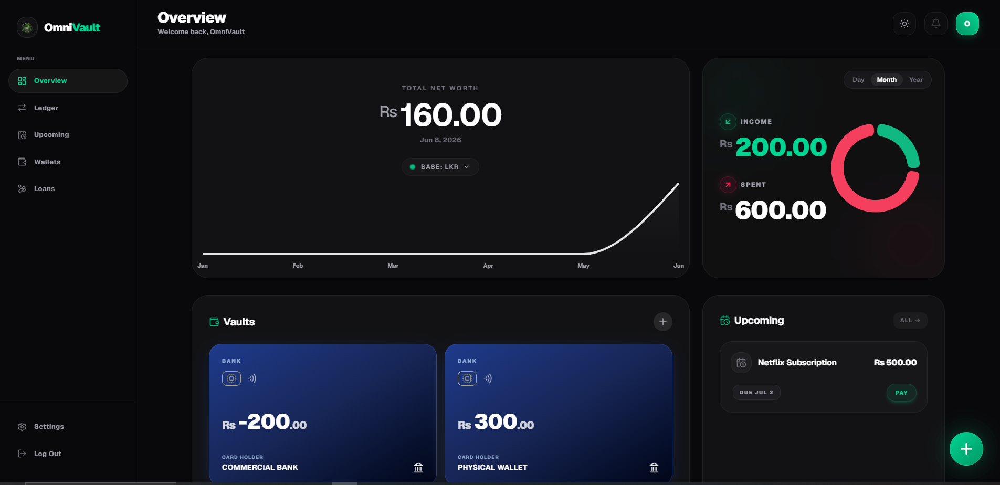
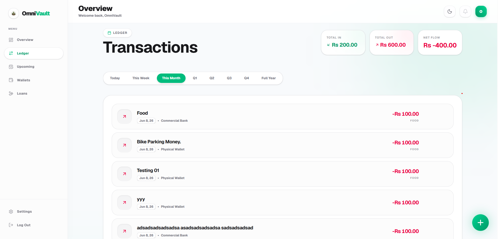
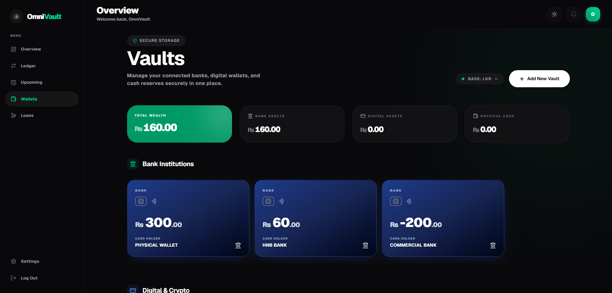
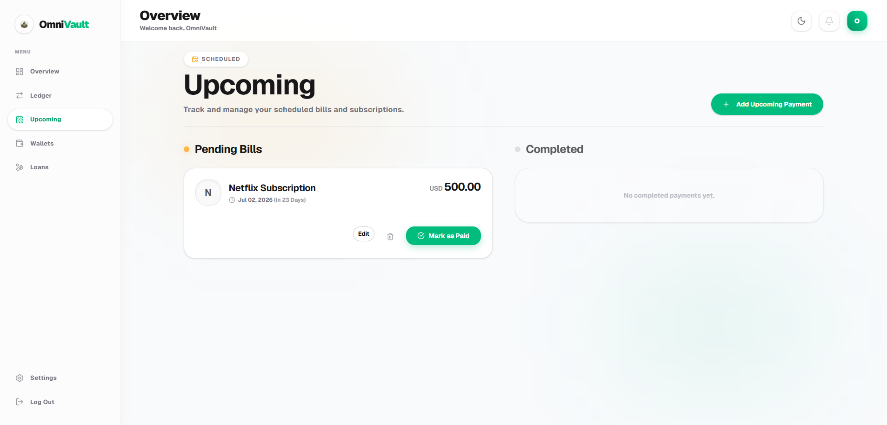
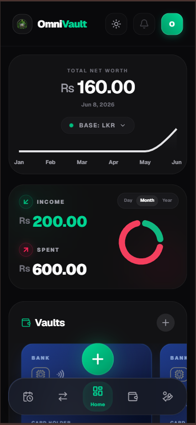
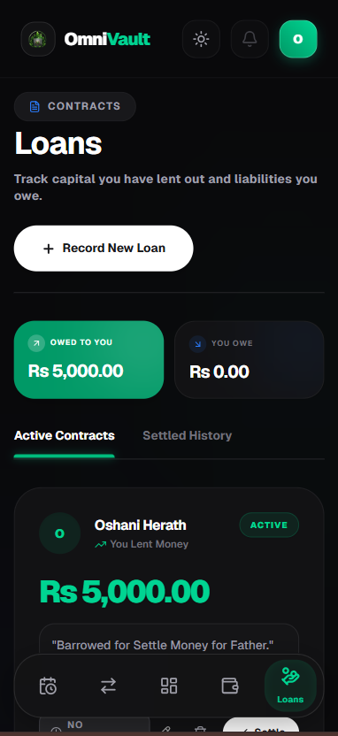
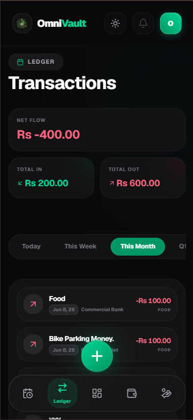

  

  # 🛡️ OmniVault

  **The Ultimate Premium Financial SaaS Dashboard & Wealth Tracker**

  
  
  

  [**ominivault-dun.vercel.app**](https://ominivault-dun.vercel.app)

  Developed by **[Dimalsha Perera](https://dimalshaperera.dev)** 👨‍💻

---

## ✨ Overview

**OmniVault** is a cutting-edge, production-ready Progressive Web Application (PWA) designed to give users absolute control over their financial wealth. From tracking digital crypto wallets and physical cash reserves to managing bank institutions and upcoming loans, OmniVault presents your data through a beautifully designed, premium Dark/Light mode interface. 

With deep integrations into Firebase Authentication and multi-currency global analytics, it serves as a secure, personal financial fortress.

---

## 📸 Screenshots

### Desktop View

  
  
  
  
  

### Mobile View

  
  
  

---

## 🚀 Key Features

*   **💳 Comprehensive Vault Management:** Track physical cash, digital assets, and institutional bank balances all in one secure place.
*   **🌍 Intelligent Global Currency Conversion:** Seamlessly toggle your entire dashboard and analytics between LKR (Rs), USD ($), and EUR (€) with real-time aggregated conversions.
*   **📊 Dynamic SaaS Analytics Grid:** Interactive "Bento" style dashboard showcasing total net worth, income/expense tracking, and interactive charts.
*   **📱 True PWA Experience:** Installable on iOS/Android devices with native-feeling UI, splash screens, and localized biometric logic (FaceID / TouchID).
*   **🔐 Military-Grade Security:** Powered by secure Firebase Authentication with robust password-reset flows and localized data protection.
*   **🎨 Stunning UI/UX Architecture:** Smooth 60FPS Framer Motion animations, deeply customizable themes (Dark/Light), and premium frosted-glass design tokens.

---

## 🛠️ Tech Stack

*   **Framework:** [Next.js 14](https://nextjs.org/) (App Router, Server Actions)
*   **Language:** [TypeScript](https://www.typescriptlang.org/)
*   **Database:** [MongoDB](https://www.mongodb.com/) (Mongoose)
*   **Authentication:** [Firebase Auth](https://firebase.google.com/)
*   **Styling:** [Tailwind CSS](https://tailwindcss.com/)
*   **Animations:** [Framer Motion](https://www.framer.com/motion/)
*   **Icons:** [Lucide React](https://lucide.dev/)
*   **Deployment:** [Vercel](https://vercel.com/)

---

## 👨‍💻 Developer

**Developed with ❤️ by Dimalsha Perera**

*   🌐 **Portfolio:** [dimalshaperera.dev](https://dimalshaperera.dev)
*   🌟 **Version:** v1.0.0 Initial Release

---

## 📝 License

This project is licensed under the MIT License - see the [LICENSE](LICENSE) file for details.

## 🤝 Contributing

Please read the [CONTRIBUTING.md](CONTRIBUTING.md) file for details on our code of conduct, and the process for submitting pull requests to us.
